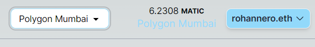
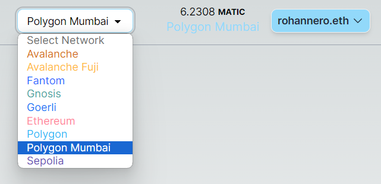

## 🍨 Dynamic Chains React Template

💭 This repo showcases a simple reusable header template for developing web3 apps with nextjs 13 app routing.

### 💎 Features

The header consists of:

1. A custom rainbow connect button that allows the user to connect to a handful of different wallets with support for additional ones being relatively simple to add.
2. An option to display the user's address in the form of a QR code.
3. A button linking the user to the chain's block explorer.
4. An interactive dropdown menu containing a list of the apps supported chains that you can easily switch to by a single click.
5. A reactive balance component displaying the user's balance in terms of the chain's native token and in USD next to the currencies symbol.

### 🧑‍🔧 Under the hood

This project was built using a handful of components from existing tools and frameworks such as:

1. [Viem](https://viem.sh/docs/getting-started.html) 🌤️
2. [Wagmi](https://wagmi.sh/) 🌥️
3. [Rainbowkit](https://www.rainbowkit.com/) 🌈
4. [Scaffold-eth-2](https://docs.scaffoldeth.io/) 🏗️
5. [Chainlink](https://docs.chain.link/data-feeds/) 🔗

Special thanks to [Avelous](https://twitter.com/Avelouseth) for his [ETH-Splitter header](https://github.com/Avelous/Eth-Splitter/blob/master/packages/nextjs/components/Header.tsx#L119-L147) which served as a big source of inspiration for this project!

And Special thanks to [Carlos](https://github.com/carletex) and [Shiv Blonde](https://twitter.com/ShivBhonde) for their major contributions to Scaffold-eth 2, which a huge chunk of the code here was pulled from.

### Quickstart

clone the repo

`git clone https://github.com/RohanNero/dynamic-chains-react-template`

Install the dependencies

`npm install`

Run the development server

`npm run dev`

Open [http://localhost:3000](http://localhost:3000) with your browser to see the result

### Updating supported chains

To update which chains your app lives on, add/remove the chain's chainId from the `includedChains` array in `/config/chainData.ts`

If you are adding a chain that isn't listed inside `/config/chainData.ts`'s `chainData` object,
you will need to add a pricefeed address from [Chainlink's list](https://docs.chain.link/data-feeds/price-feeds/addresses?network=ethereum&page=1).

If a USD pricefeed doesn't exist on Ethereum mainnet for your chain, then you will need to provide an RPC url for your chain inside of the `chainData` object.
